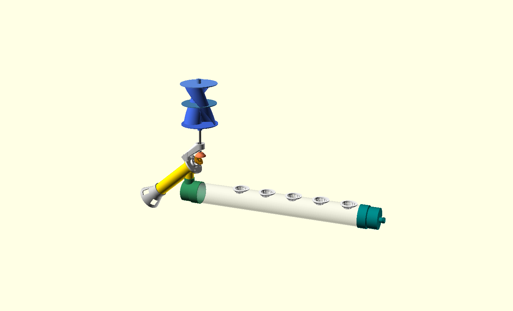
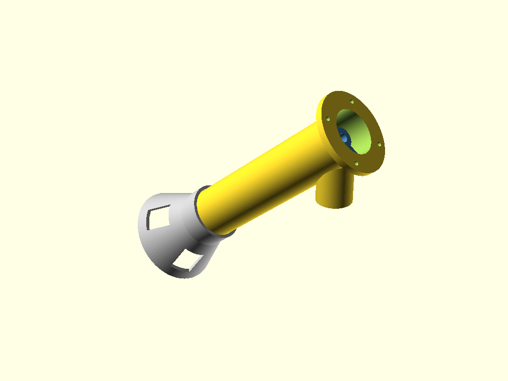
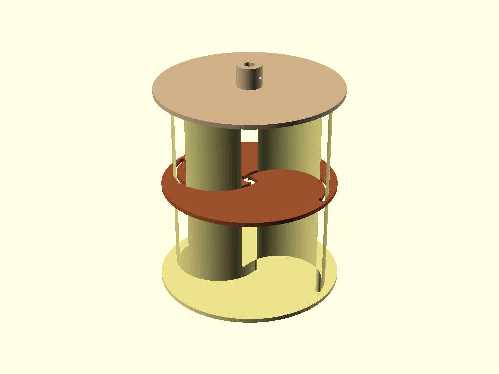
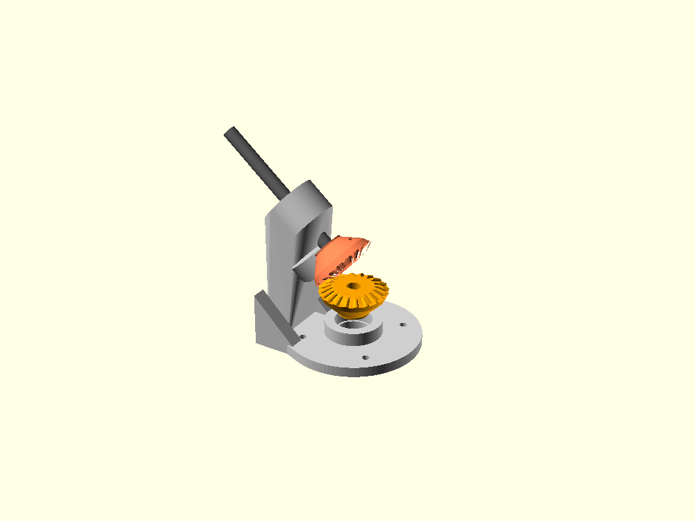
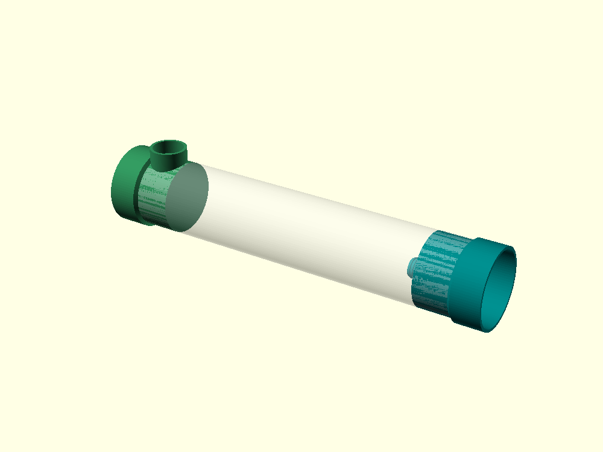
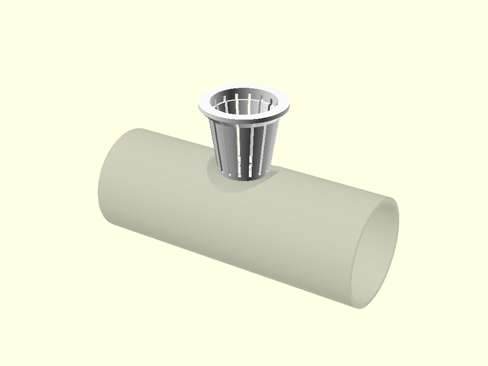
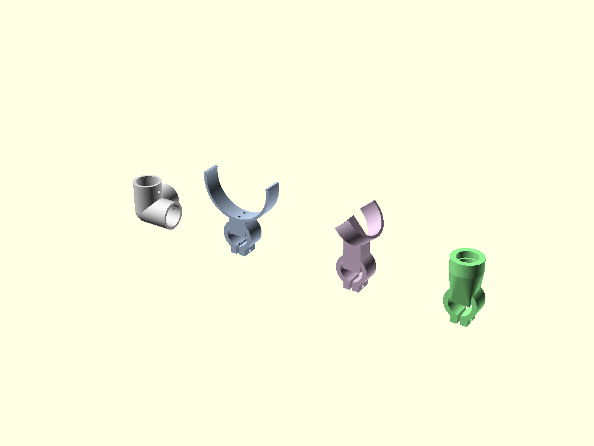
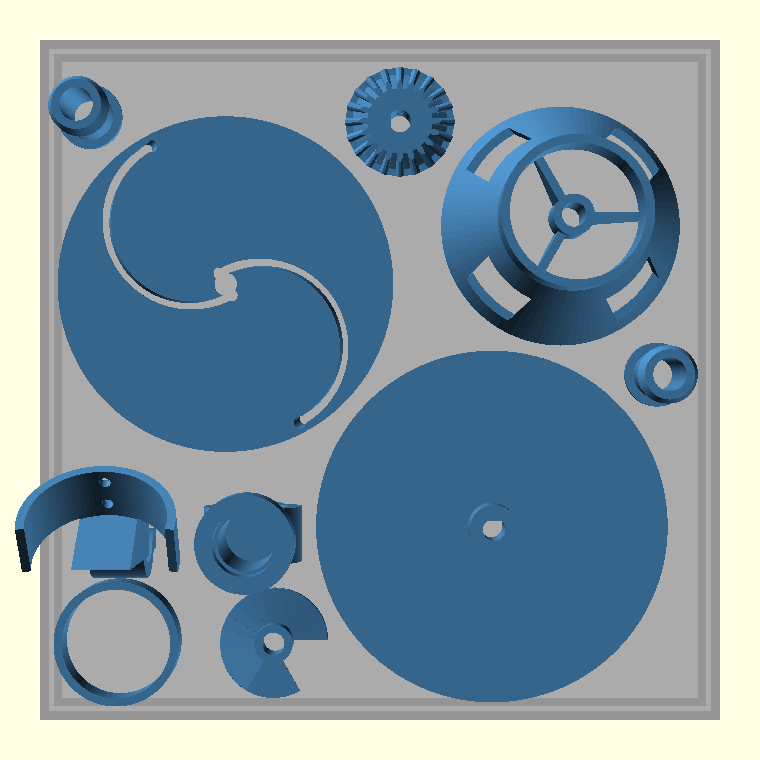
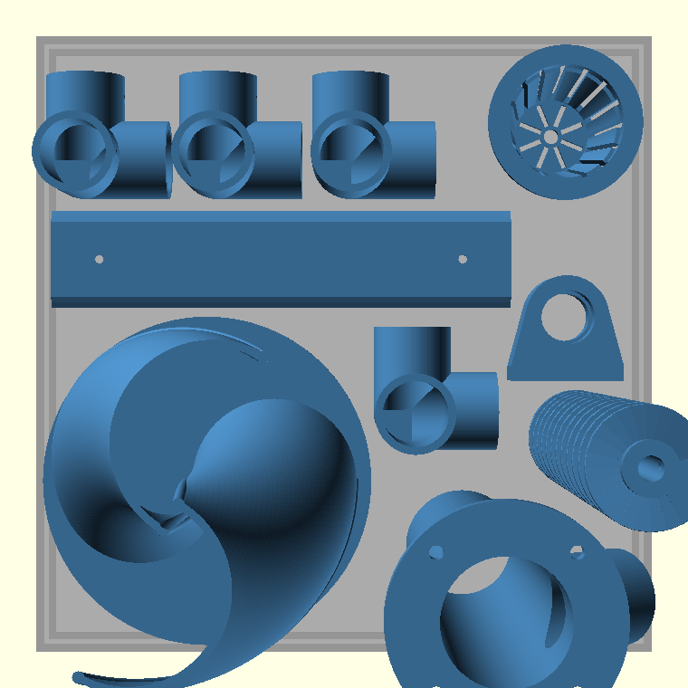

# Bomba de Arquímedes eólica para canal hidropónico — modelos OpenSCAD

Seis módulos paramétricos, sin librerías externas, más una vista de conjunto y
un script de análisis. Las 19 piezas se han exportado a STL con OpenSCAD
2021.01: todas salen como sólido cerrado y sin auto-intersecciones
(`Simple: yes`), y todas caben en los 256 × 256 × 256 mm de la P2S.



## Configuración global aplicada

| Regla | Valor | Dónde |
|---|---|---|
| Suavizado | `$fn = 100` | todas las superficies curvas |
| Pared mínima | 3.0 mm | carcasa, embudo, tapones, cubos, alojamientos |
| Tolerancia | 0.3 mm | uniones mecánicas |

Dos criterios, declarados en cada archivo:

* **Deslizante o rotativa** → `Ø + 2·tol`. Boquilla Ø32 en manguito Ø32.6;
  casquillo de PVC Ø75 → Ø75.6. La excepción es la holgura hélice-carcasa, que
  no la manda el montaje sino la hidráulica: 0.15 mm radial (ver más abajo).
* **A presión** → `Ø + 1·tol`. Agujero Ø8.3 sobre varilla de Ø8.

## Las dos decisiones que gobiernan el resto

**1. El tornillo trabaja inclinado 40°, no vertical.** Un Arquímedes vertical no
bombea: el agua no forma cangilones cerrados. El agua rebosa de un cangilón al
de abajo por el **canto interior** del filete, cuya cota vale
`h(θ) = −Ri·cos α·cos θ + (S·sin α/2π)·θ`. Solo hay barrera si esa función tiene
mínimo, es decir si

```
k = S · tan(α) / (2 π · Ri)  <  1      ← con el radio INTERIOR
```

Con `Ri = 7.15` y α = 40° el paso máximo real son **53.5 mm**. El criterio que
suele citarse usa `Ro` y es cuatro veces más permisivo: habría dado por bueno un
paso de 190 mm. Elevación útil resultante: **116 mm** con los 180 mm de hélice
del enunciado.

**2. Con turbina de eje vertical y tornillo a 40°, el par cónico no es de 90°.**
Los dos ejes se cortan en el ápice de los conos primitivos y salen de él hacia
sus respectivos engranajes: el mástil hacia arriba y el eje del tornillo hacia
abajo-adelante. El ángulo entre esas direcciones es

```
Σ = 90 + inclinación = 130°   →   cono primitivo = Σ/2 = 65°  (relación 1:1)
```

Con `inclinacion = 0` el par degenera en el cónico clásico de 90°/45°, que era
lo especificado en el enunciado original.


## Lo que dice la física (ver `analisis_bomba.py`)

El volumen de cangilón no tiene fórmula cerrada: se integra numéricamente. El
modelo está validado contra el único caso con solución exacta —cuando el paso
tiende a cero el agua ocupa la parte del anillo con `x ≥ Ri`, un segmento
circular de fracción 0.3180 para esta geometría— y el numérico converge a él
(0.276 → 0.297 → 0.309 con pasos de 3, 1.5 y 0.6 mm).

**El paso de 30 mm del enunciado dejaba la bomba en cero.** El llenado del
cangilón cae con el paso y la fuga por la holgura crece con el salto de carga
por filete (`S·sin α`). Integrando ambos efectos, el caudal neto a 300 rpm:

| paso | volumen/vuelta | llenado | fuga | **caudal neto** |
|---:|---:|---:|---:|---:|
| 10 mm | 1.40 mL | 12.7 % | 0.03–0.12 | 0.30–0.39 L/min |
| **15 mm** | **1.50 mL** | **9.1 %** | **0.05–0.15** | **0.30–0.40 L/min** |
| 20 mm | 1.49 mL | 6.8 % | 0.07–0.17 | 0.28–0.38 L/min |
| 30 mm | 1.44 mL | 4.4 % | 0.10–0.21 | 0.22–0.33 L/min |
| 36 mm | 1.26 mL | 3.2 % | 0.12–0.23 | 0.15–0.26 L/min |

El óptimo es plano entre 12 y 20 mm; el modelo usa **15 mm**, que además deja
12 vueltas exactas en los 180 mm. Con el paso de 30 mm *y* la holgura original
de 0.3 mm el caudal neto a 300 rpm era prácticamente nulo.

**La holgura radial es el parámetro más sensible del proyecto.** Fija unas rpm
mínimas por debajo de las cuales la bomba no entrega nada, porque todo lo que
sube se vuelve por la rendija:

| holgura radial | fuga | rpm mínimas útiles |
|---:|---:|---:|
| 0.10 mm | 0.01–0.10 L/min | 10–64 |
| **0.15 mm** | **0.05–0.15 L/min** | **33–97** |
| 0.20 mm | 0.12–0.20 L/min | 78–129 |
| 0.30 mm | 0.30–0.40 L/min | 193–263 |

De ahí la pieza **`calibre`**: un anillo de carcasa y un tramo de tornillo que se
imprimen en diez minutos para medir el error real de la máquina antes de gastar
filamento en el tubo de 200 mm.

**El par que pide el tornillo es ridículo; el que manda es el rozamiento.** El
margen frente a la carga hidráulica (23 µN·m) es de dos órdenes de magnitud, pero
esa no es la comparación útil: el rotor tiene que vencer el rozamiento del tren, y
tres rodamientos 608ZZ con la grasa de fábrica suman ~1500 µN·m. Con eso el viento
de arranque son **3.0 m/s**; desengrasados baja a **1.4 m/s** (`arranque.py`).
Quitar la grasa es la intervención de mayor efecto de todo el proyecto y es gratis.
En cambio el tornillo tiene su propia velocidad crítica. La fórmula de Muysken
(`N ≈ 50/D^(2/3)`) está calibrada para tornillos de obra: entre 0.5 y 2 m mantiene
la aceleración centrípeta del radio exterior en 1.3–1.4 g, pero extrapolada a Ø40
pide 4.1 g, que no es el mecanismo. El centrifugado exige `N ∝ D^(−1/2)`:
recalibrando sobre el punto de 1 m salen **250 rpm**, y el criterio puro de tambor
(`ω²R = g`) da 211. Una Savonius libre los supera ya con **1.6 m/s**:

| viento | potencia en el eje | rpm libres | rpm útiles | caudal neto |
|---:|---:|---:|---:|---:|
| 2 m/s | 18 mW | 318 | 250 | 0.23–0.33 L/min |
| 3 m/s | 60 mW | 477 | 250 | 0.23–0.33 L/min |
| 6 m/s | 476 mW | 955 | 250 | 0.23–0.33 L/min |

O sea: **el caudal satura en ~0.28 L/min desde 1.6 m/s** y el tornillo está
saturado prácticamente siempre. El caudal no lo pone el viento, lo pone el volumen
de cangilón. `mejoras.py` cuantifica las seis intervenciones que suben ese techo y
los otros tres; las dos primeras —sombrear el canal y una válvula de flotador— no
tocan el diseño. Con vendaval conviene desmontar el rotor: nada lo frena.

## Archivos

```
01_tornillo_arquimedes.scad   tornillo · carcasa · embudo
02_turbina_savonius.scad      rotor · disco_sup · disco_medio
03_soporte_rodamientos.scad   soporte · alojamiento · engranaje · acople
04_tapones_pvc75.scad         tapon_a · tapon_b
05_net_cup_50.scad            vaso · plantilla
06_estructura.scad            conector_3v · abraz_canal · abraz_carcasa · sop_mastil
07_conjunto_general.scad      vista de obra (importa los STL, no imprimible)
08_montaje.scad               vistas paso a paso del montaje
analisis_bomba.py             modelo hidráulico, energético y agronómico
mejoras.py                    qué interviene sobre cada techo, y cuánto
arranque.py                   balance de par en el arranque y viento de cebado
verificacion.py               comprueba que la cadena de cotas cierra
render_stl.sh                 exporta los 20 STL a ./stl
bandejas.py                   reparte las piezas en bandejas de la P2S
infografia.py                 genera montaje.html, la guía de montaje
```

```bash
openscad -o tornillo.stl -D 'pieza="tornillo"' 01_tornillo_arquimedes.scad
./render_stl.sh                       # todas las piezas -> ./stl
python3 bandejas.py                   # -> stl/bandeja_1..3.stl, listas para laminar
openscad 07_conjunto_general.scad     # vista de obra, tras render_stl.sh
```

`pieza = "conjunto"` en cualquier módulo muestra su vista de montaje.

---

## Módulo 1 · Tornillo de Arquímedes y carcasa



| Pieza | Uds | Cotas |
|---|---|---|
| `tornillo` | 1 | helicoide Ø40, **paso 15**, largo 180 (12 vueltas), núcleo Ø14.3 |
| `carcasa` | 1 | tubo **Ø40.3**/Ø46.3, largo 200, boquilla Ø32, corona 4×M4 |
| `embudo` | 1 | boca Ø90 con ventanas de admisión y buje liso Ø8.6 |
| `calibre` | 1 | anillo + tramo de tornillo para verificar el ajuste antes de imprimir |

* **Núcleo Ø14.3 y no Ø8.** La varilla es de Ø8; con núcleo de Ø8 no quedaría
  material alrededor del agujero. Se calcula como `Ø8.3 + 2·3`.
* **Helicoide por barrido con `hull()`**, no `linear_extrude(twist)`: con *twist*
  el filete se adelgaza al crecer el radio (~0.5 mm a Ø40, no imprimible). El
  barrido da 2.2 mm de espesor axial constante.
* **La boquilla es un tramo recto girado exactamente la inclinación**, así que
  cae **a plomo** con el conjunto montado y su boca queda cortada horizontal.
  No hace falta codo.
* El embudo va **suelto de patas**: cuelga sumergido y la carcasa la sujeta la
  abrazadera del Módulo 6. Cuatro ventanas dejan entrar agua aunque la boca
  quede cerca del fondo. Lleva la araña con el buje inferior del eje.
* Carcasa partida en tubo (200 mm) + embudo (77 mm) para que ambas quepan de pie.
* Espesor de filete 2.0 mm = 4 líneas exactas de 0.5 mm: sin huecos entre
  perímetros, que es por donde se cuela el agua.

## Módulo 2 · Turbina Savonius helicoidal



| Pieza | Uds | Cotas |
|---|---|---|
| `rotor` | 1 | Ø120 × 150 total, álabes de 2.5 mm, torsión 120° |
| `disco_sup` | 1 | Ø132 × 3 con ranura helicoidal de encaje |
| `disco_medio` | 1 | Ø126 × 3, ranuras pasantes |

* Geometría S clásica: dos semicilindros de Ø66 con 12 mm de solape
  → `D = 2·66 − 12 = 120`.
* **Álabe helicoidal (120°).** Reparte el par en la vuelta: arranca solo desde
  cualquier posición y baja el rizado, que es lo que necesita un tornillo de
  Arquímedes a bajo régimen. El límite lo pone la impresión: el canto se inclina
  `atan(R·torsión/altura)` y el archivo aborta si pasa de 45°. Con 120° sale
  **40.7°**, autoportante; con 180° serían 52.6° y pediría soportes.
* Las ranuras de los discos **no son rectas**: copian la sección helicoidal a la
  cota exacta de montaje. Comprobado por booleana — restar la ranura al tramo de
  álabe correspondiente da geometría vacía, mientras que con la ranura sin
  corregir (control negativo) queda material. El disco intermedio no se desliza:
  **se enrosca** hasta media altura.
* Los discos superior e intermedio se imprimen aparte: un disco de Ø132 impreso
  en el aire sobre los álabes se descolgaría.

## Módulo 3 · Soporte, rodamientos y reenvío cónico



| Pieza | Uds | Cotas |
|---|---|---|
| `soporte` | 1 | los **dos** alojamientos 608 (uno vertical al tornillo, otro a 50° para el mástil), base 4×M4 a PCD 60 |
| `engranaje` | 2 | cónico 1:1, m=2, z=20, Ø primitivo 40, Ø cabeza exterior 41.7 |
| `alojamiento` | 0–1 | chumacera 608 suelta |
| `acople` | 0–1 | acople rígido 8–8, alternativa si los ejes se alinean |

* **El perfil de evolvente se genera en el propio archivo** (`inv_deg`,
  `diente_2d`), sin librerías.
* El dentado se extruye escalado hacia el ápice (Tredgold) y después se
  **recorta con los dos conos reales**:
  * *cono de cabeza* (ápice en el ápice primitivo, semiángulo `δ + atan(m/A₀)`).
    Sin él la punta del diente sobra `m·(1−cos δ)` = 1.15 mm y se clava en el
    fondo del conjugado.
  * *cono trasero*, perpendicular al primitivo en el punto primitivo exterior.

  Con ambos, el radio de cabeza exterior sale **20.845 mm = r + m·cos δ**, la
  cota de norma. La interferencia medida entre los dos engranajes engranados
  cayó de **0.016 cm³ a 0.002 cm³**; lo que queda está repartido en cinco
  dientes alrededor del punto primitivo, donde los conos son tangentes por
  definición, y es del orden del error de teselado.
* **Juego entre flancos de 0.3 mm** (`juego_g`), restado del semiespesor
  angular. Sin él el par se agarrota.
* El soporte **resta el volumen de giro de los dos engranajes**, así que ni el
  brazo ni las cartelas pueden rozar aunque se cambien las cotas. Antes de
  añadirlo, el brazo rozaba 1 mm³ con el engranaje del mástil.
* Impresión sin soportes: cubo abajo, alma cónica a 45°, dentado arriba. El
  dentado siempre reduce su radio al subir, sea δ 45° o 65°.

## Módulo 4 · Tapones del canal de PVC Ø75



| Pieza | Uds | Cotas |
|---|---|---|
| `tapon_a` | 1 | casquillo Ø75.6/Ø81.6, cámara, manguito Ø32.6 y **placa aireadora** |
| `tapon_b` | 1 | ídem + racor de rebose Ø12 y **respiradero** |

* `modo_encaje = "exterior"` (casquillo sobre el tubo) o `"interior"` (macho
  dentro del tubo): de ahí lo de *ajustables*. El escalón entre encaje y cámara
  hace de tope, sin piezas añadidas.
* **Comprueba la pared real de tu tubo** (`tubo_pared`, 1.8 o 3.0 mm): de ella
  dependen el Ø interior y la cota del rebose.
* La lámina de agua la fija `nivel_agua = 25`: el eje del racor se coloca en
  `−Ø_int/2 + 25 + Ø_racor/2 = −3.5 mm` respecto al eje del tubo, para que la
  **generatriz inferior** del paso quede a 25 mm del fondo interior.
* El agua no entra por un solo agujero sino por una **placa perforada de 7×Ø5**:
  el chorro se rompe en gotas y se airea. El balance de oxígeno de más abajo lo
  convierte en obligatorio, no en un adorno.
* El Tapón B lleva **respiradero**: sin él el canal queda estanco y las raíces
  aéreas, que son las que sostienen la planta durante las calmas, no renuevan aire.
* La profundidad de encaje del manguito **se deriva** del hombro de tope
  (4 mm sobre la generatriz del conducto) en vez de fijarse a mano: fijarla
  hacía caer el hombro justo en la tangente de la cámara y generaba un sólido
  degenerado.

## Módulo 5 · Vasos de cultivo Ø50



| Pieza | Uds | Cotas |
|---|---|---|
| `vaso` | n | Ø50 → Ø35, alto 50, pestaña Ø60 × 3 mm |
| `plantilla` | 1 | galga curva para marcar dos taladros al paso elegido |

* 16 ranuras verticales de 2 mm y 8 radiales en el fondo, más drenaje Ø6. Las
  del fondo no llegan al canto: el anillo exterior queda continuo.
* Pared de 2.5 mm en vez de 3: la regla de 3 mm cubre las piezas estancas; la
  canastilla es celosía sin presión. El parámetro está expuesto.
* Taladro en el canal **Ø50.6**, separación **150 mm** para lechuga (ver el
  balance de oxígeno); 100–120 mm sirve para albahaca y hoja pequeña.
* Chaflán de 45° bajo la pestaña: el vuelo de 5 mm sale sin soporte.

## Módulo 6 · Estructura



| Pieza | Uds | Función |
|---|---|---|
| `conector_3v` | 4–8 | nudo de esquina de 3 vías para bastidor de tubo Ø25 |
| `abraz_canal` | 2–3 | cuna de 200° que retiene el canal Ø75 a presión |
| `abraz_carcasa` | 1–2 | ídem para la carcasa, con la cuna ya girada a 40° |
| `sop_mastil` | 1 | abrazadera con alojamiento 608 para el mástil |

* Anillo partido con oreja y tornillo M4 con alojamiento hexagonal.
* Las cunas abrazan más de 180°, así que sujetan a presión; además llevan
  pasadores para brida de nylon.
* Las cunas se posicionan por `children()` y el vaciado se hace al final, de
  forma que la columna de unión sube hasta el eje y la junta nunca queda a tope.

---

## Cadena de cotas del montaje

Origen: base del tubo de la carcasa (boca del casquillo del embudo), con el
conjunto ya inclinado. `07_conjunto_general.scad` recalcula e imprime todo esto.

| Cota | Valor |
|---|---|
| Elevación útil del tornillo (180 mm a 40°) | 115.7 mm |
| Eje de la boquilla (descarga) | z = 115.7 mm |
| Boca de la boquilla | z = 60.7 mm |
| Vuelo libre de la boquilla fuera de la carcasa | 24.6 mm (14 encajan en el manguito) |
| **Eje del canal de PVC** | **z = 22.2 mm, x = 137.9 mm** |
| Lámina de agua en el canal (la fija el rebose) | z = 12.7 mm |
| Ápice del par cónico | (185.4, 0, 155.6) |

**Consecuencia de diseño que conviene tener presente:** con los 180 mm de hélice
del enunciado el canal queda forzosamente bajo — su eje a 22 mm sobre la base de
la carcasa — porque el agua no puede salir más arriba de donde termina el
tornillo. El depósito tiene que ser bajo o ir embutido, y su lámina debe quedar
por encima de las ventanas del embudo y por debajo de z = 12.7 mm para que el
retorno baje por gravedad. Si necesitas el canal más alto, sube `largo_util` o
`inclinacion` (a 60° la elevación pasa a 156 mm y Λ sigue valiendo 0.41 < 1).


## Lo que dice la biología

**Esto es DFT, no NFT, y no por elección.** La lámina de 25 mm no es un capricho:
con tubo redondo de Ø75 el fondo interior queda 34.5 mm bajo el eje, mientras que
un vaso de 50 mm solo baja 9.5 mm. Para que la base del vaso alcance el agua hace
falta esa lámina. La relación exacta es

```
inmersión de la base del vaso = nivel_agua + pared_del_tubo − 28   (mm)
```

con los valores por defecto da **0 mm**: la base del vaso roza la superficie. Es
la posición correcta para planta establecida —la raíz baja al agua y la parte
alta del cepellón respira en aire húmedo—. Para plántula, sube `nivel_agua` a
28 mm y la base queda 3 mm sumergida.

**El oxígeno, no el agua, es lo que limita cuántas plantas caben.** Con el caudal
neto de referencia:

| Magnitud | Valor |
|---|---|
| Volumen del canal (Ø69, 25 mm, 600 mm) | 0.73 L |
| Caudal neto a 300 rpm | 0.36 L/min |
| Renovación completa del canal | 2.0 min |
| O₂ aportado (Δ 3 mg/L aprovechables) | 65 mg/h |
| Demanda de 4 lechugas adultas | 60 mg/h |

Van justos. De ahí las dos decisiones: **máximo 4 lechugas por tramo de 600 mm**
(separación 150 mm) y placa aireadora en la entrada, porque esos 3 mg/L solo
existen si el agua entra saturada. Con albahaca o lechuga baby la demanda cae a
la mitad y caben 6.

**Las calmas son el riesgo real, y la reserva no las cubre.** El canal disuelve
5.9 mg de O₂; cuatro lechugas se los comen en **6 minutos**. Lo que salva a la
planta cuando para el viento no es el agua almacenada sino la fracción de raíz
que respira en aire, y eso exige que el canal esté ventilado: de ahí el
respiradero del Tapón B y el hecho de que el manguito de entrada no cierre.

**Materiales, desde la biología.** Nada de PLA: además de hidrolizarse, en un
baño templado y rico en nutrientes es literalmente una fuente de carbono para la
microbiota. PETG o ASA. Y **filamento pigmentado, nunca natural translúcido**:
la luz que entra en el agua es algas, y las algas compiten por el oxígeno que
acabamos de ver que va justo. La pestaña de Ø60 sobre un taladro de Ø50.6 ya
sombrea el hueco del vaso.

Para limpiar, los tapones son de encaje deslizante: se sacan a mano y el canal se
enjuaga. Conviene hacerlo: las líneas de capa de una pieza impresa son un sustrato
de biofilm excelente.

## Impresión en Bambu Lab P2S

Volumen 256 × 256 × 256 mm, CoreXY cerrada con **cámara pasiva** (40–50 °C
imprimiendo ASA), nozzle de acero endurecido (0.2 / 0.4 / 0.6 / 0.8), cama hasta
110 °C y AMS 2 Pro con secado activo. La pieza más alta del proyecto son los
180 mm del tornillo, así que todo entra de pie.

**El truco que decide la estanqueidad es aritmético.** Una pared de 3 mm con
boquilla de 0.4 y ancho de línea por defecto (0.42) da 7.14 líneas: el laminador
pone 7 y deja 0.06 mm que rellena con *gap fill*, y ahí es donde rezuma. Fija el
ancho de línea para que la pared sea un número entero de perímetros:

| Pared del diseño | Con nozzle 0.4 | Con nozzle 0.6 |
|---|---|---|
| 3.0 mm (carcasa, tapones) | 6 líneas × **0.50** | 5 líneas × **0.60** |
| 2.5 mm (álabe, vaso) | 5 líneas × **0.50** | 4 líneas × **0.625** |
| 2.0 mm (filete) | 4 líneas × **0.50** | — |

Con eso, **4–5 perímetros bastan para que sea estanco** y el 100 % de relleno
deja de ser necesario: en un tubo de 200 mm de ASA es contraproducente (más masa,
más contracción, más riesgo de grieta). Si prefieres cinturón y tirantes, mantén
el 100 % solo en los tapones, que son cortos.

Activa **Scarf joint seam** (costura en bisel) en carcasa, embudo y tapones:
elimina el canal de fuga que deja la costura alineada. En el tornillo importa
todavía más por otro motivo: la costura sobresale 0.05–0.15 mm y la holgura de
diseño son 0.15 mm, así que un pegote de costura roza. Imprime primero el
`calibre`.

| Pieza | Material | Nozzle | Orientación | Soportes |
|---|---|---|---|---|
| tornillo | PETG | 0.4 | de pie | no |
| carcasa | PETG | 0.6 | de pie, boca abajo | solo bajo la boquilla |
| embudo | PETG | 0.6 | de pie, boca arriba | no |
| rotor, discos | **ASA** | 0.6 | rotor de pie; discos planos | no |
| soporte, chumacera | ASA | 0.6 | base en la cama | no |
| engranajes | PETG | 0.4 | cubo abajo | no |
| tapones | PETG | 0.6 | eje del tubo vertical, fondo abajo | manguito del Tapón A |
| racor | PETG | 0.6 | brida sobre la cama | no |
| vasos | PETG | 0.4 | de pie, boca arriba | no |
| estructura | ASA | 0.6 | ver módulo 6 | conector_3v |

**El helicoide sale sin soportes**, y la razón se puede escribir en una línea.
Cada capa se desplaza tangencialmente `(capa/paso)·2πr`, y la sección del filete
a ese radio mide `espesor·2πr/paso`. El cociente no depende ni del radio ni del
paso:

```
solape entre capas = 1 − altura_de_capa / espesor_del_filete
```

Con capa de 0.2 mm y filete de 2.0 mm, **90 % de solape**: cada capa apoya casi
entera sobre la anterior. Mientras el filete sea al menos cinco veces la altura
de capa, el helicoide es autoportante por muy tumbado que parezca su plano.

Ajustes concretos:

* **PETG**: secar 6 h a 65 °C en el AMS 2 Pro. Cama 70–80 °C sobre placa
  texturizada y **barra de pegamento como desmoldeante**, no como adhesivo: el
  PETG se une químicamente al PEI liso y arranca el recubrimiento. Ventilador
  30–50 %.
* **ASA**: secar 4 h a 80 °C. Cama 100 °C, falda o balsa, ventilador de pieza al
  mínimo y puerta cerrada. La cámara pasiva de la P2S llega a 40–50 °C, suficiente
  para estas piezas; imprime de una en una para no perder temperatura.
* Deja la compensación de pata de elefante por defecto (0.15 mm): sin ella las
  primeras capas del tubo aprietan sobre el tornillo.
* Sin *ironing* en las caras de los engranajes.


## Plan de bandejas: todo el sistema en 3 impresiones

`bandejas.py` no coloca a ojo. Lee los STL, aplica a cada pieza su rotación de
impresión, y empaqueta las **siluetas reales** —la envolvente convexa de la
planta, rasterizada a 1 mm y dilatada la mitad de la separación— en vez de las
cajas envolventes. La diferencia no es cosmética: dos discos de Ø132 no caben
lado a lado en 246 mm, pero **sí caben en diagonal**, y eso solo lo ve un
empaquetador que trabaje con la forma. Con cajas salían 5 bandejas; con siluetas
salen 3.

Tres es además el mínimo alcanzable: la suma de las huellas da 2.45 bandejas, y
la primera ya va al 89 %.

| | Piezas | Altura | Ocupación | Material | Tiempo |
|---|---|---|---|---|---|
| **Bandeja 1** | calibre, embudo, disco medio, disco superior, engranaje, 2 racores, abrazadera de carcasa, soporte de mástil | 89 mm | 89 % | ~220 g | ~7 h |
| **Bandeja 2** | **carcasa, tornillo**, rotor, chumacera, plantilla, vaso, 4 conectores | 200 mm | 83 % | ~460 g | ~15 h |
| **Bandeja 3** | torreta, engranaje, tapón A, tapón B, 3 vasos, 2 abrazaderas de canal, 2 conectores | 92 mm | 73 % | ~430 g | ~13 h |

Total ≈ **1.1 kg y 35 h**. El tiempo es una estimación con 10 mm³/s efectivos y
capa de 0.2 mm; el material es cota superior, porque cuenta como macizo lo que el
laminador rellenará al 15–25 % en las secciones gruesas.

 

**El orden importa y no es arbitrario.** El `calibre` va en la bandeja 1 y el
tornillo y la carcasa en la 2: hay que medir el ajuste antes de imprimir las dos
piezas que dependen de él. Por eso la bandeja 1 tampoco lleva ninguna pieza alta
—acaba en unas 7 h y ya tienes la medida— mientras que la 2 es la larga.

**Un solo material.** El reparto de arriba supone ASA para todo, y es la
recomendación: es estable a UV *y* al agua (es el material de los tubos de
saneamiento), y la cámara cerrada de la P2S es justo lo que necesita. Separar
PETG para lo mojado y ASA para lo soleado obliga a partir cada bandeja por
material y sube de 3 a 4–5 impresiones. Si no tienes buena ventilación —el ASA
huele— usa PETG en todo y cuenta con cambiar el rotor cada dos o tres años.

**Cómo laminarlo:**

1. `./render_stl.sh && python3 bandejas.py`
2. Importa `stl/bandeja_1.stl` en Bambu Studio. **No pulses auto-organizar**: la
   colocación ya viene resuelta. Si la centra en la cama no pasa nada, las
   posiciones relativas se mantienen.
3. Botón derecho → *Split to objects* si quieres ajustes por pieza. Hace falta
   en las bandejas 2 y 3: solo dos piezas del proyecto piden soporte —el Tapón A
   por el manguito y el `conector_3v` por sus dos bocas horizontales— y conviene
   activarlo únicamente en ellas. La bandeja 1 no lleva ninguna.
4. Ancho de línea según la tabla de más arriba y costura en bisel.

Si prefieres repartir el riesgo en vez de minimizar arranques, saca la carcasa y
el tornillo a una bandeja propia: son 15 h de la bandeja 2 y un fallo a mitad se
lleva por delante el rotor. Pasarías a 4 impresiones.

Para cambiar el reparto —otro número de vasos, otro bastidor— edita la lista
`PIEZAS` de `bandejas.py`: cantidad, rotación de impresión y si la pieza está
atada a la primera bandeja o excluida de ella.

## Interfaces

| Unión | Criterio | Valor |
|---|---|---|
| Hélice ↔ carcasa | holgura hidráulica | Ø40 / **Ø40.3** (0.15 mm radial) |
| Varilla ↔ tornillo, cubos, engranajes | a presión | Ø8 / Ø8.3 |
| Varilla ↔ buje del embudo | giro libre | Ø8 / Ø8.6 |
| Carcasa ↔ soporte | corona Ø74 | 4×M4 a PCD 60 |
| Boquilla ↔ Tapón A | deslizante | Ø32 / Ø32.6, 14 mm de encaje |
| Vaso ↔ canal | taladro | Ø50.6 |
| Rodamiento 608 ↔ cajera | a presión | Ø22.2 × 7.4, labio Ø19.5 |
| Bastidor ↔ abrazaderas | deslizante | Ø25 / Ø25.6 |

## Comprobaciones hechas

* `verificacion.py` corre 34 comprobaciones sobre los parámetros que devuelve el
  propio OpenSCAD: ajustes, alineación de taladros, cotas de montaje del par
  cónico, longitudes de varilla, cadena de cotas del vertido y ventana de nivel
  del depósito. Todas pasan.
* Las 20 piezas exportan a STL como sólido cerrado y simple, y caben en 256³.
* El plan de bandejas se verifica por coordenadas: nada sale de la cama
  (X e Y entre 7 y 244 mm) y ninguna silueta se solapa.
* El modelo de cangilón converge al valor analítico exacto del límite de paso
  pequeño (0.3180): validado, no ajustado.
* Encaje álabe/disco: booleana vacía en disco superior e intermedio, con control
  negativo que sí deja material (la prueba no pasa por vacuidad).
* Engranaje del mástil contra el soporte: 1 mm³ de roce → **0** tras añadir el
  volumen de giro.
* Engrane de los dos cónicos: 16 mm³ → **2 mm³** tras recortar por cono de
  cabeza y cono trasero, residuo del orden del teselado.
* El juego entre flancos se verificó midiendo volumen del engranaje con
  `juego_g` = 0 / 0.3 / 1.0 mm: 11.809 / 11.757 / 11.635 cm³.

## Materiales y herrajes

* Varilla inoxidable Ø8: ~250 mm (tornillo) + ~350 mm (mástil de la turbina).
* 3 × rodamiento **608ZZ** (2 en la torreta, 1 en el soporte del mástil).
* Prisioneros M3×6 (8 uds), tornillería M4×20 con tuerca (10 uds).
* Tubo de Ø25 para el bastidor y tubo PVC Ø75 de evacuación para el canal.
* Manguito flexible Ø12 para el retorno del rebose al depósito.

## Laminado

Los ajustes están en la sección de impresión en P2S de más arriba. En resumen:
PETG para lo mojado, ASA para lo que da el sol, ancho de línea que haga entera la
pared, costura en bisel y nada de PLA.

## Guía de montaje

`infografia.py` genera **`montaje.html`**: la guía pieza a pieza, con las vistas
de cada paso compuestas desde los STL reales, el inventario de las veinte piezas,
los dos diagramas de cotas críticas y el acta de comprobación. Se regenera con
`./render_stl.sh && python3 infografia.py`.

## Orden de montaje

1. Buje del embudo, embudo a presión sobre la carcasa, tornillo sobre la varilla.
2. Torreta atornillada a la corona (4×M4); rodamiento 608 vertical y engranaje
   cónico del tornillo, con el ápice a 42 mm de la base de la torreta.
3. Mástil: 608 en el brazo inclinado de la torreta + `sop_mastil` en el
   travesaño del bastidor. Comprobar engrane antes de apretar prisioneros.
4. Rotor Savonius: pegar el disco superior en su ranura y **enroscar** el disco
   intermedio hasta media altura.
5. Bastidor de Ø25 con `conector_3v`; fijar la carcasa con `abraz_carcasa` a 40°
   y el canal con `abraz_canal`.
6. Canal: taladrar Ø50.6 con la plantilla, Tapón A bajo la boquilla y Tapón B
   con el racor hacia el depósito.
